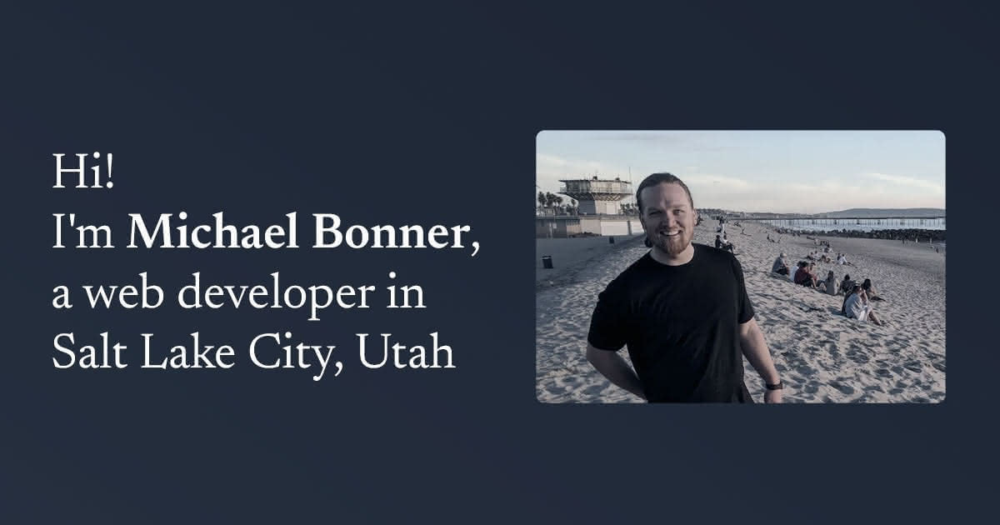

<a href="https://michaelbonner.dev?utm_source=github"></a>

Public site for [michaelbonner.dev](https://michaelbonner.dev/).

## Getting Started

First, run the development server:

```bash
bun run dev -- --open
```

A browser should open at [http://127.0.0.1:5173/](http://127.0.0.1:5173/) to see the result.

You can start editing the page by modifying `src/routes/index.svelte`. The page auto-updates as you edit the file.
